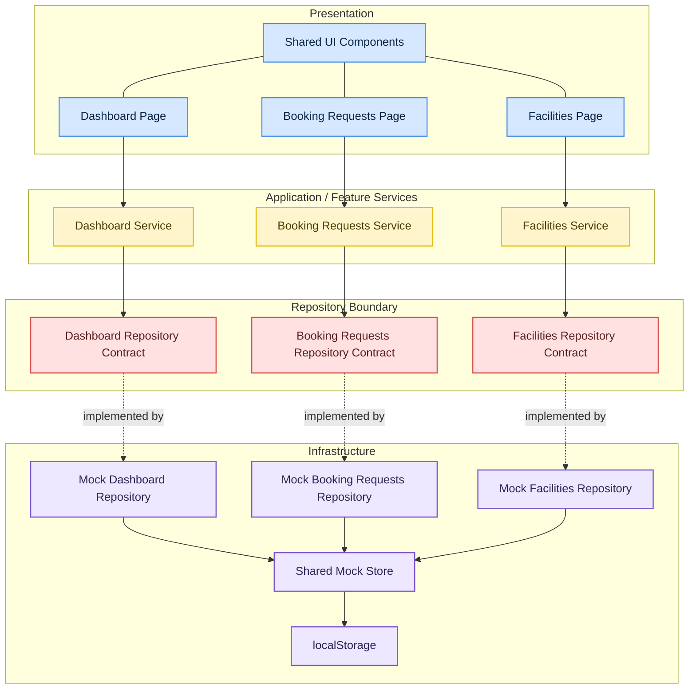

# Forestince Admin

> Architecture principle: **High cohesion, low coupling**

Forestince Admin is a responsive operations platform for managing campus facilities, booking demand, and usage visibility. The implementation is intentionally documented from an architectural perspective: clear boundaries, swappable data access, and a structure that can evolve without forcing UI rewrites.

## Architecture summary

- `feature-first` modules keep behavior close to the domain they serve
- each feature owns its own `repository`, `repository.mock`, and `service`
- the UI depends on feature services rather than raw data sources
- repositories define the data boundary and isolate infrastructure concerns
- a shared local store simulates the current data source while preserving a backend-ready shape
- state changes in one feature propagate to other read models through the same internal contracts

## Dependency direction



This direction keeps orchestration in the service layer, keeps data access behind repositories, and prevents presentation code from coupling itself to infrastructure details.

## Feature map

- `dashboard/`
  exposes the operational overview read model
- `booking-requests/`
  owns the approval and rejection flow for incoming requests
- `facilities/`
  owns capacity, utilization, and availability surfaces
- `shared/`
  contains reusable UI primitives, styling, icons, and low-level utilities
- `app/`
  wires routing and service composition together

## Why this structure scales

- high cohesion: each feature keeps its own types, repository contract, repository implementation, and service behavior in one place
- low coupling: UI consumes stable service APIs and does not know whether data comes from local state, HTTP, or another source
- incremental extensibility: repositories can be reimplemented without changing page-level code
- controlled complexity: the code avoids a god service while also avoiding unnecessary enterprise ceremony

## Current runtime model

The current implementation uses a shared local store with `localStorage` persistence. That choice keeps the application instant while preserving the same interaction shape a remote backend would expose. Replacing the current implementations with `Http*Repository` variants is a bounded infrastructure change, not a UI rewrite.

More detail:

- [Architecture](./docs/architecture.md)
- [How I Use AI](./docs/how-i-use-ai.md)

## Setup

```bash
yarn install
yarn build
yarn dev
```

The app runs on `http://localhost:4173`.
