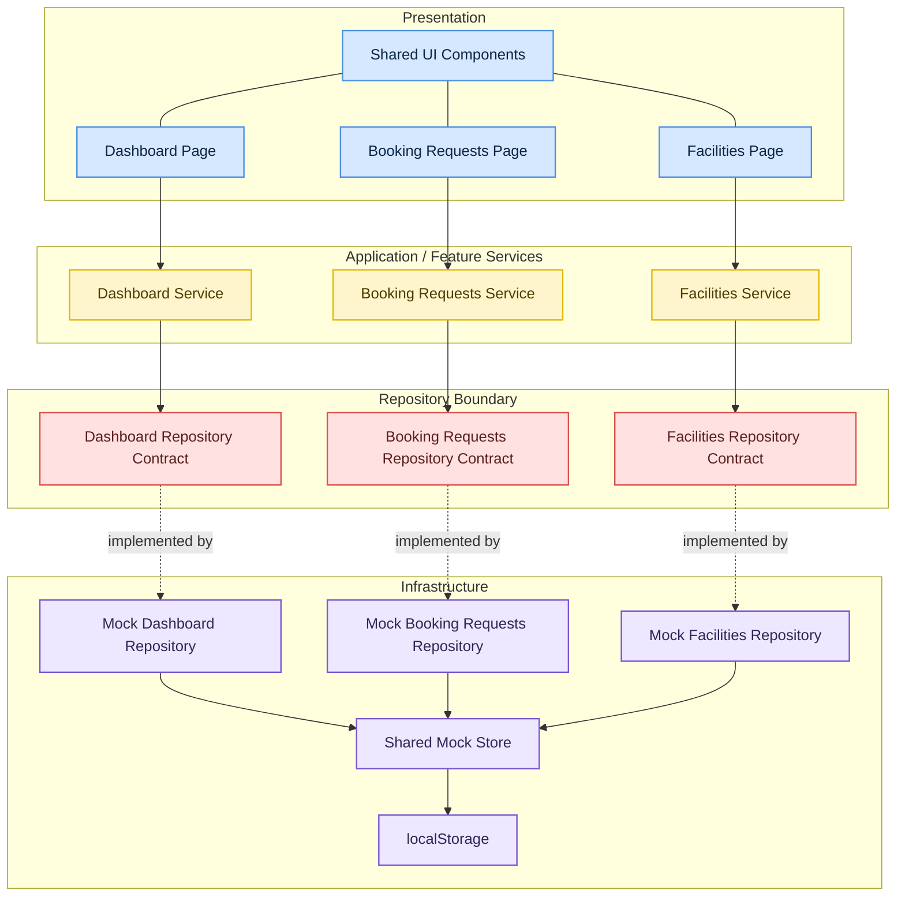

# Architecture Overview

> Guiding principle: **High cohesion, low coupling**

## Design principles

The architecture is organized around a small set of rules:

- high cohesion inside each feature boundary
- low coupling between UI, business behavior, and infrastructure
- stable internal contracts for future data-source changes
- small runtime surface with predictable rendering behavior
- local decisions that do not block future extension

## Requirement analysis and system framing

I broke the requirement into four concerns:

- responsive UI
- one complete behavioral flow
- a replaceable data boundary
- a structure that can extend without a rewrite

## Scope selection and tradeoffs

I selected the booking-request approval flow because it exercises multiple read models with one user action.

One decision updates:

- queue state
- dashboard metrics
- recent bookings
- facility pressure

Key tradeoffs:

- mocked data was chosen over a real backend to keep the system simple and leave a clean path to switch data sources later
- heavy client libraries were avoided because they add cost without improving the core architecture
- feature-first boundaries were chosen over generic global layers to keep related logic together and reduce coupling

## Layering

### Why this shape

- components render and react to user intent
- services coordinate feature behavior and cross-read-model effects
- repository contracts define what the feature needs from a data source
- repository implementations handle how data is read or written
- the store is infrastructure, not presentation state

## Feature-first structure

Each feature owns its own `repository`, `repository.mock`, and `service`:

- `dashboard/`
- `booking-requests/`
- `facilities/`

This keeps each slice cohesive. The business language, data access, and orchestration for a feature stay together instead of being scattered across generic global folders.

## Shared mock store

The shared store is the current data source. It centralizes:

- current entities
- derived counters
- persistence through `localStorage`
- state transitions that affect multiple read models

This matters because an approval is not a local page event. It changes several surfaces at once:

- the pending queue shrinks
- dashboard metrics change
- recent bookings changes
- facility pressure changes

The shared store gives that behavior a single source of truth without leaking data mutation logic into components.

## Repository boundary

Repositories are contracts first, implementations second.

That boundary exists so the rest of the application depends on capability, not storage strategy. Today the implementation is local. Tomorrow it can be remote:

- `HttpDashboardRepository`
- `HttpBookingRequestsRepository`
- `HttpFacilitiesRepository`

No page should care.

## Service layer

Services exist to keep orchestration out of components. They are intentionally small, but they are not pass-through by accident. Their job is to coordinate feature behavior at the correct level of abstraction.

Examples:

- a request approval updates the inbox and then refreshes dashboard read models
- a page asks a service for a feature view, not for low-level storage primitives

That is why the UI consumes `dashboard.getOverview()` or `requests.approveRequest()` instead of mutating local data directly.

## Why this reads as SDK-like

The UI consumes stable, typed feature APIs rather than raw data. In practice, the services form an internal client surface:

- `dashboard.getOverview()`
- `requests.getInbox()`
- `requests.approveRequest()`
- `facilities.getOverview()`

That gives the system a library-like shape:

- consumers know what operations are available
- consumers do not know how those operations are implemented
- implementations can change behind the same contract

## Scalability path

The current structure supports the next step without needing a rewrite:

1. replace `repository.mock` with HTTP-backed implementations
2. keep service signatures stable
3. keep page composition stable
4. add richer domain rules at the service layer when needed

That is the central tradeoff in this codebase: stay lightweight now, but never in a way that collapses future options.
